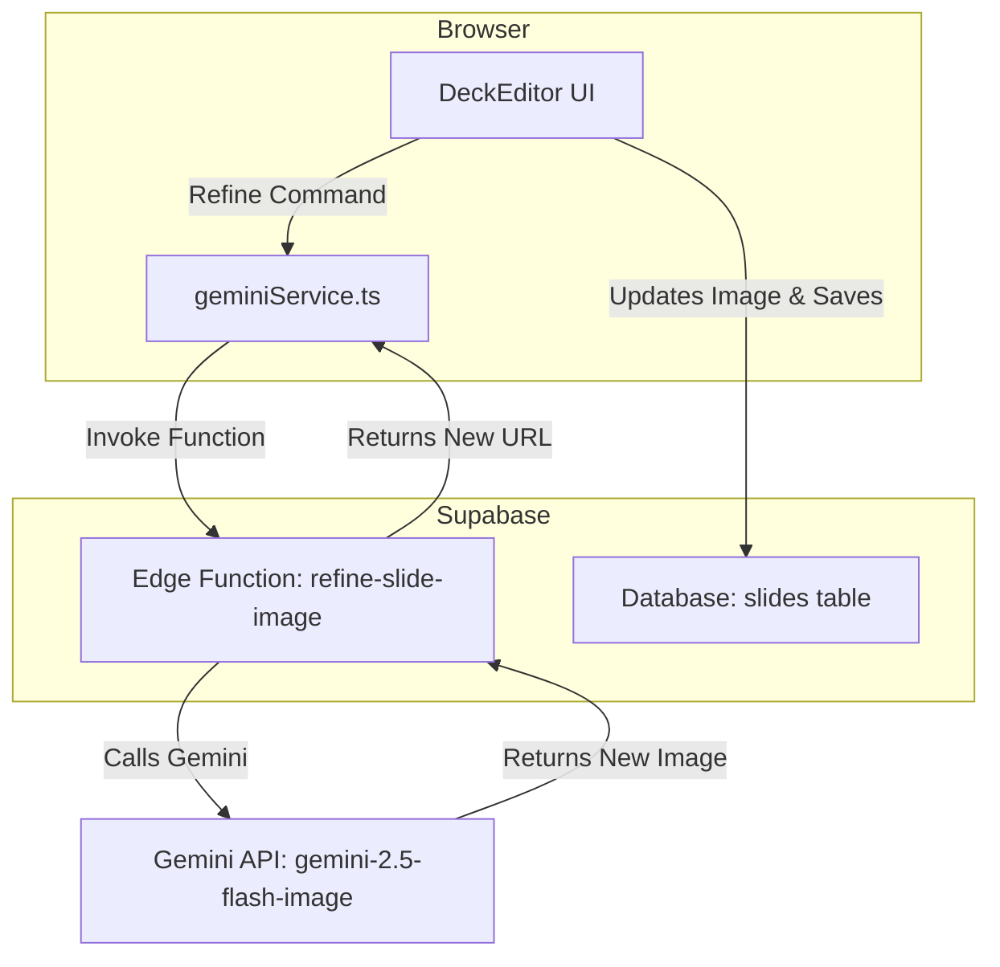
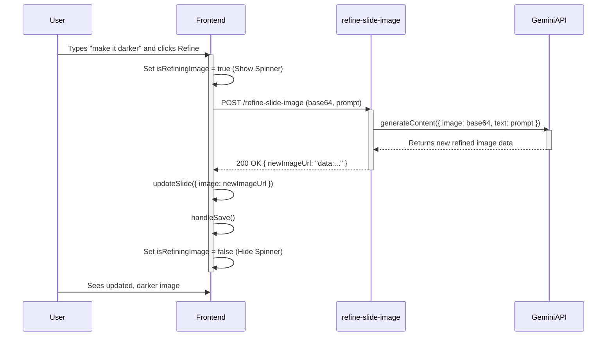

# AMO AI: Conversational Image Refinement Implementation Plan

**Task Name**: Implement AI-Powered Conversational Image Refinement

**Purpose**:  
> To empower users with fine-grained creative control by allowing them to iteratively refine AI-generated slide images using natural language text prompts. This evolves the image generation feature from a one-shot creation tool into an interactive design assistant, significantly increasing the user's ability to achieve their desired visual outcome.

**Success Criteria**:  
> - **Functionality:** Users can successfully submit a text prompt to modify an existing slide image, and the image updates in the UI within 15 seconds.
> - **Quality:** For a standardized test suite of 10 refinement prompts (e.g., "change the background color to dark blue," "add a subtle geometric pattern"), the resulting image correctly reflects the user's intent in >80% of cases.
> - **Performance:** The end-to-end latency (from user submission to UI update) for the P95 should be under 20 seconds.
> - **User Satisfaction:** Achieve a user-reported satisfaction score of >4.0/5.0 for the feature's quality and usability within the first month of launch.

**Dependencies**:  
- **APIs:** Google Gemini API (`gemini-2.5-flash-image`), Supabase Edge Functions, Supabase Database API.
- **Data Sources:** Existing slide image data (as a base64 string) and the deck's `visualThemeBrief` from the Supabase database.
- **Approvals:** Final UI/UX review of the new refinement input components in the `DeckEditor`.

---

## 1. Inputs & Resources  
- **Data**:
  - A test suite of 10 base images and 20 corresponding refinement prompts.
  - User session JWT for authenticated requests.
- **Tools/Services**:   
  - Supabase Project (DB, Auth, Edge Functions)
  - Google AI Studio (for prompt engineering and testing)
  - Deno Runtime Environment for Edge Functions
- **Stakeholders**: 
  - Product Lead (reviewing quality of image outputs)
  - Lead Frontend Engineer (UI integration)
  - Backend Engineer (Edge Function implementation)

## 2. Steps  
1. **Init: Backend Setup**  
   - **Checklist**:
     - [ ] Create a new Supabase Edge Function named `refine-slide-image`.
     - [ ] Ensure the function has access to the `GEMINI_API_KEY` environment variable.
     - [ ] Implement CORS and JWT-based authentication checks.

2. **Implement: Backend Agent Logic**  
   - **Flow**: The `refine-slide-image` function will accept a JSON body containing `base64ImageData`, `mimeType`, and `refinementPrompt`.
   - It will construct a multimodal request for the `gemini-2.5-flash-image` model, including both the original image (`inlineData`) and the user's text prompt.
   - The prompt will instruct the model to *edit the provided image* based on the text command.
   - It will extract the new base64 image data from the Gemini API response.
   - It will return the new base64 image as a JSON payload: `{ "newImageUrl": "data:image/png;base64,..." }`.

3. **Implement: Frontend Integration**
   - **UI Changes (`DeckEditor.tsx`):**
     - Add a new input field and a "Refine" button below the slide image preview.
     - This UI will only be active when an image is present.
   - **State Management:**
     - Add a new loading state, e.g., `isRefiningImage`, to show a spinner over the image during refinement.
   - **Service Layer (`geminiService.ts`):**
     - Create a new function `refineSlideImage(base64Image: string, prompt: string): Promise<string>`.
     - This function will call the `refine-slide-image` Edge Function.
   - **Component Logic (`DeckEditor.tsx`):**
     - The "Refine" button's `onClick` handler will:
       1. Set `isRefiningImage(true)`.
       2. Call the `refineSlideImage` service function.
       3. On success, update the active slide's `image` property with the new URL and save the deck via `handleSave()`.
       4. On failure, show an error toast.
       5. Set `isRefiningImage(false)`.

4. **Error handling**  
   - **On Gemini API Failure:** The Edge Function will catch API errors and return a `500` status with a clear error message (e.g., "Image refinement failed. Please try again.").
   - **On Invalid Input:** The Edge Function will return a `400` status if the image data or prompt is missing.
   - **Frontend:** The `DeckEditor` will use a `try...catch` block to handle errors from the service call and display a user-friendly toast notification.

5. **Logging**  
   - The `refine-slide-image` Edge Function will log every invocation, including `deckId`, `slideId`, and the duration of the Gemini API call.
   - Any errors will be logged with the full error stack for debugging.

## 3. Testing & Validation  
- **Unit**: 
  - Test the prompt construction logic in the Edge Function.
  - Test the frontend state management for `isRefiningImage`.
- **Integration**: 
  - **Happy Path:** Test the full end-to-end flow: user types "make it blue," clicks "Refine," sees a loading state, and the image updates to a blue version.
  - **Failure Path:** Test the UI's response when the Edge Function returns an error. Ensure a toast message appears and the loading state is cleared.
- **Metrics**: 
  - **Success Rate:** >98% of valid requests should complete without errors.
  - **Latency:** P95 response time under 20 seconds.

## 4. User Journey & Workflow

1.  **Starts:** The user is in the `DeckEditor` and has already generated an image for a slide. They like the composition but want to change the color.
2.  **Action:** They type "Change the accent color to a deep purple" into the new "Refine Image" input field below the image preview.
3.  **Feedback:** They click the "Refine" button. The button becomes disabled, and a loading spinner overlay appears on the image, indicating that the AI is working.
4.  **Process:** The frontend sends the current image and the text prompt to the `refine-slide-image` Edge Function. The function calls the Gemini API, which generates a new, modified image.
5.  **Outcome:** The loading spinner disappears, and the slide image in the preview is replaced with the new version featuring a deep purple accent color. The change is automatically saved.
6.  **Loop:** The user can now enter another prompt to refine the new image further, enabling an iterative design process.

## 5. Supabase Schema Changes

**No changes are required for the database schema.** The existing `slides` table, with its `image` column of type `text`, is sufficient to store the `data:` URL of the refined image. This feature is purely operational, leveraging existing data structures.

## 6. Mermaid Diagrams

### System Architecture Update

### Sequence Diagram for Image Refinement

## 7. Troubleshooting  
| Symptom                | Cause                       | Fix                                |
|------------------------|-----------------------------|------------------------------------|
| Refinement has no effect or is wrong | The prompt sent to Gemini is not specific enough or is misinterpreted. | Refine the system prompt within the Edge Function to give the model better instructions for *editing* vs. *replacing*. |
| Request fails with a 500 error | The Gemini API call failed, or an error occurred in the Edge Function. | Check the Supabase Edge Function logs for the specific error message from the Gemini API or Deno runtime. |
| UI gets stuck in a loading state | The frontend did not correctly handle an error from the service call. | Review the `try...catch...finally` block in the `DeckEditor`'s refinement handler to ensure `isRefiningImage` is always set to `false`. |

---

## ✔️ Quick Checklist  
- [x] Name, Purpose, Success Criteria defined.
- [x] Dependencies identified.
- [x] Resources listed.
- [x] Steps for backend and frontend are implemented.
- [x] User Journey, Workflow, and Diagrams are created.
- [x] Tests defined.
- [x] Troubleshooting table filled.
