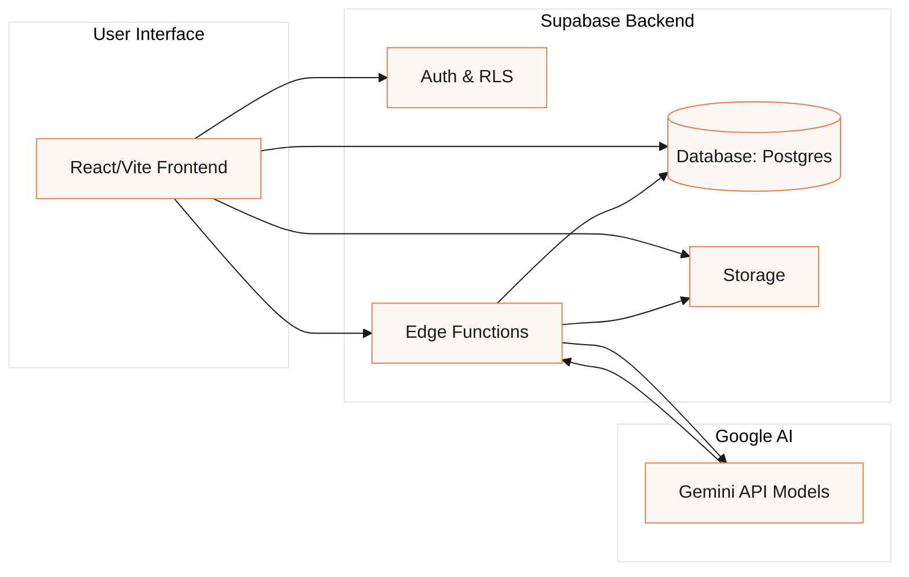
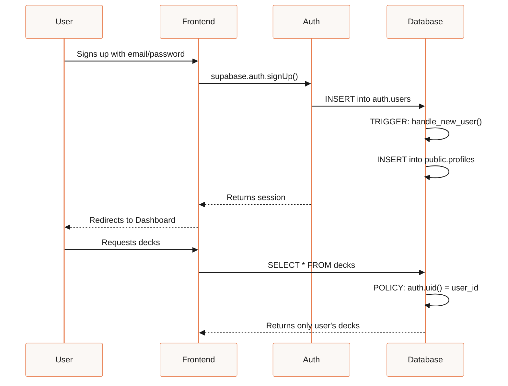
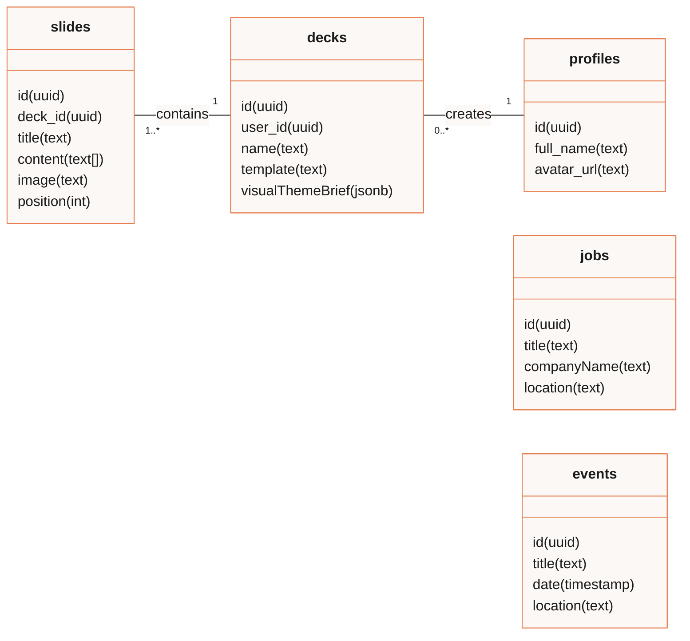
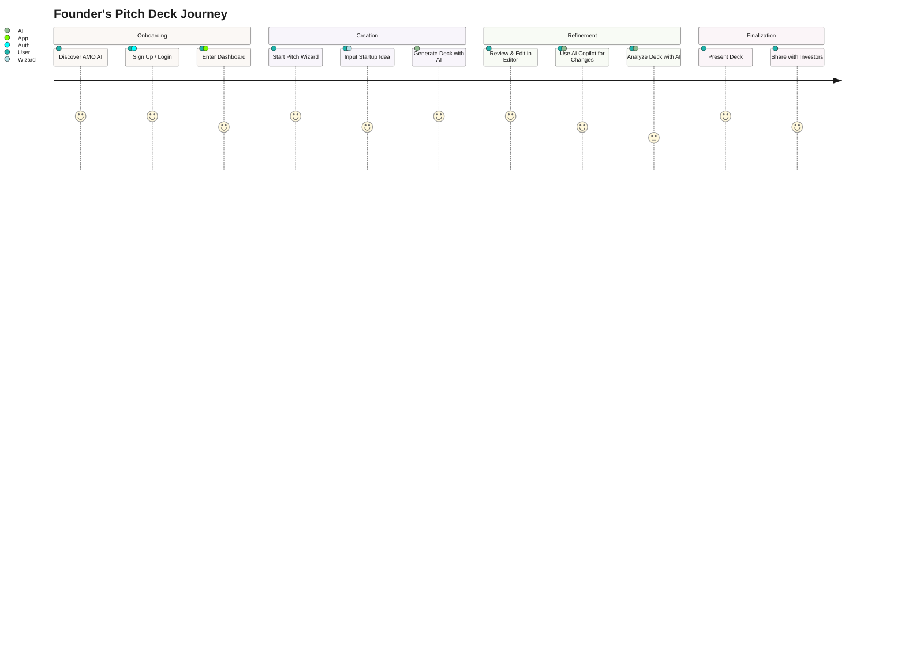
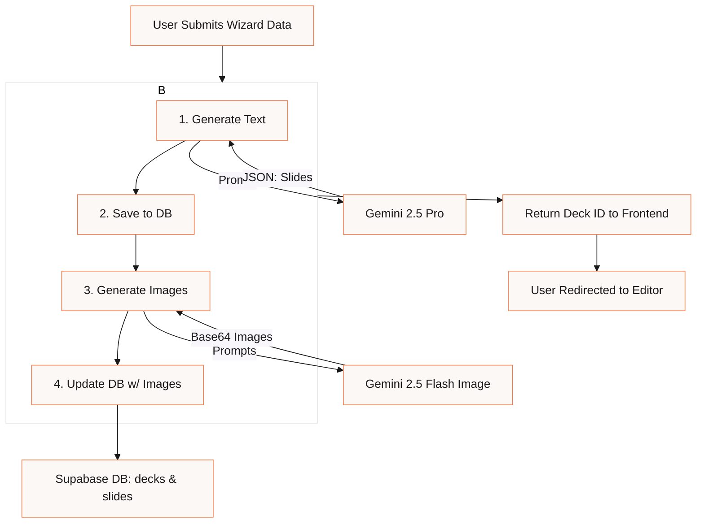
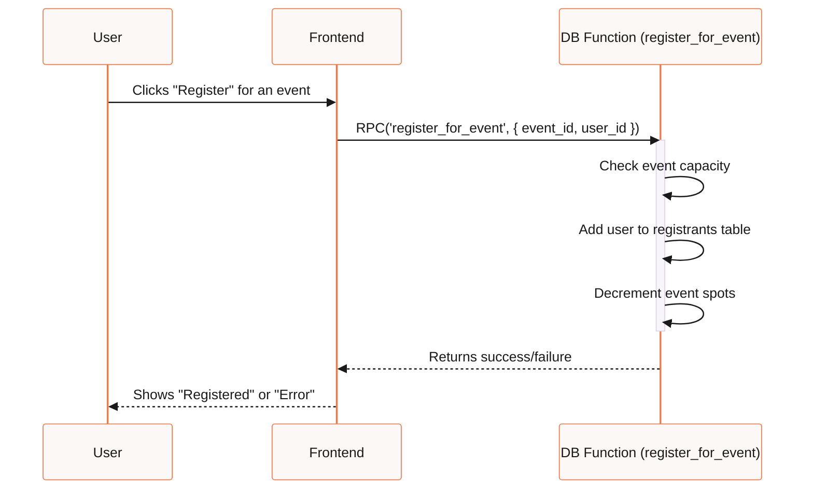
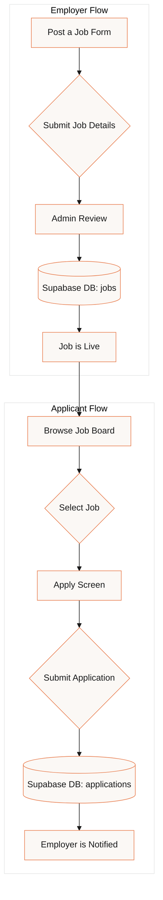
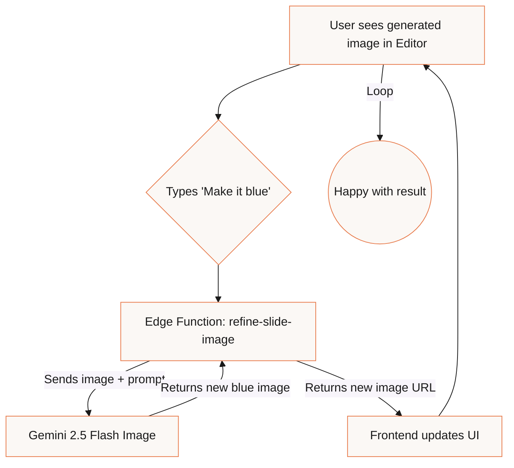

# AMO AI: System Architecture & Workflow Diagrams

This document provides a complete set of architectural diagrams for the AMO AI platform. It visualizes the relationships between all modules, data flows, and user journeys, serving as a technical reference for the entire system.

---

## 1️⃣ Summary

AMO AI is an intelligent, integrated platform designed to support startup founders. It combines a powerful AI-driven Pitch Deck Wizard with a suite of community and growth-oriented tools.

### Core Features
- **Authentication & Profiles:** Secure user management via Supabase Auth, with user profiles and Row-Level Security (RLS).
- **Pitch Deck Wizard:** A guided, multi-step process for inputting startup ideas.
- **Deck Editor & Dashboard:** A robust interface for managing, editing, and viewing generated pitch decks.
- **AI Content Generation:** Core text and image generation for slides using Gemini models.

### Advanced Features
- **Interactive AI Copilot:** Conversational deck editing using Gemini's Function Calling.
- **Strategic Analyst Agent:** Deep deck analysis and scoring using Gemini's 'Thinking' feature.
- **Market Research Agent:** Real-time data fetching with Google Search Grounding.
- **Thematic Visual Design:** Cohesive, brand-aligned image generation for entire decks.
- **Community Modules:** A full suite of tools including a Job Board, Perks Marketplace, and Events System.

---

## 2️⃣ Mermaid Diagrams

### System Overview
*File: `docs/diagrams/00-system-overview.mmd`*
  This diagram shows the high-level architecture, illustrating how the user interacts with the frontend, which in turn communicates with the Supabase backend and the Gemini AI layer.

### Auth & RLS Data Flow
*File: `docs/diagrams/01-auth-flow.mmd`*
  This sequence diagram details the user sign-up process, the automatic profile creation via a database trigger, and how subsequent data requests are securely filtered by RLS policies.

### Database ERD
*File: `docs/diagrams/02-database-erd.mmd`*
  This Entity-Relationship Diagram shows the structure of the core database tables and their relationships.

### User Journey
*File: `docs/diagrams/03-user-journey.mmd`*
  This diagram illustrates the primary path a new founder takes through the AMO AI platform, from landing on the homepage to creating and finalizing their first pitch deck.

### AI Flow for Deck Creation
*File: `docs/diagrams/04-ai-flow.mmd`*
  This flowchart details the end-to-end process of generating a new pitch deck, from the user's initial input to the final storage of text and images.

### Event Registration Sequence
*File: `docs/diagrams/05-event-registration.mmd`*
  This diagram shows the atomic and secure process for a user registering for an event, handled by a hypothetical `register_for_event` function.

### Jobs & Applications Flow
*File: `docs/diagrams/06-jobs-flow.mmd`*
  This flowchart shows the two main paths for the Job Board: a company posting a new job and a candidate applying for it.

### Advanced AI Feedback Loop (Image Refinement)
*File: `docs/diagrams/07-ai-feedback-loop.mmd`*
  This diagram illustrates the advanced, iterative workflow for conversational image refinement, where the user can fine-tune visuals in a loop.

