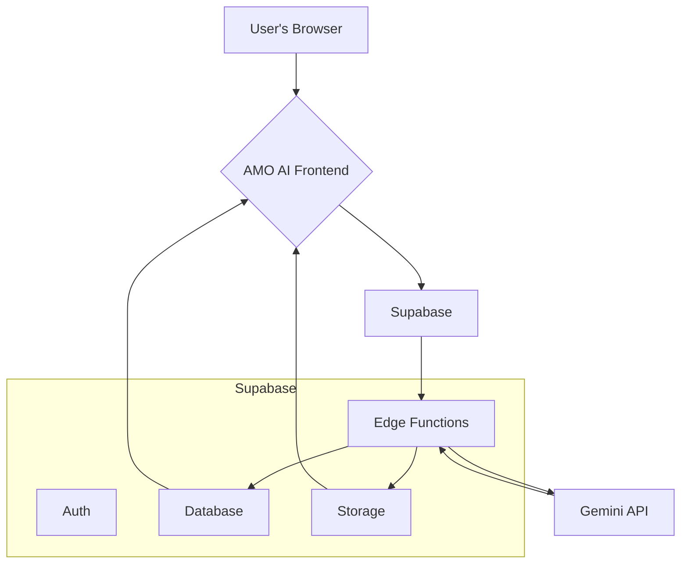
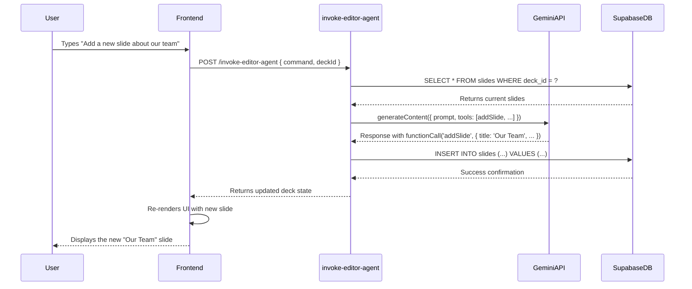

# AMO AI: Pitch Deck Wizard — Implementation Plan

## 1. Overview

This document outlines the complete technical and operational plan to upgrade the AMO AI Pitch Deck Wizard from a static generator into a dynamic, interactive, and intelligent platform.

The core objective is to execute the top three strategic priorities identified in the Gemini API audit:
1.  **Secure the architecture** by migrating all AI logic and data persistence to a Supabase backend.
2.  **Introduce interactive editing** by implementing a `SlideEditorAgent` powered by Gemini's Function Calling feature.
3.  **Enhance visual creation** by building a `VisualAssetAgent` capable of generating thematically consistent imagery for entire decks.

This implementation will transition the application from a client-side tool to a scalable, secure, and multi-user SaaS product, establishing a strong foundation for future features like collaboration, analytics, and advanced AI agents.

---

## 2. Project Plan & Task Breakdown

The project is broken down into three sequential phases. Each phase builds upon the last, minimizing risk and delivering value incrementally.

| Phase | Task | Description | Dependencies | Effort | Role | Success Criteria |
| :--- | :--- | :--- | :--- | :--- | :--- | :--- |
| **P1: Foundation** | **1.1: Setup Supabase** | Initialize Supabase project, configure database, auth, and storage. | - | **S** | Backend | Project is live; DB tables are created. |
| *(Supabase & Security)* | **1.2: Implement Schema & RLS** | Create `profiles`, `decks`, `slides` tables. Implement Row-Level Security policies. | 1.1 | **M** | Backend | RLS tests pass; users can only access their own data. |
| | **1.3: Migrate to Edge Functions** | Move all client-side `geminiService` logic into Supabase Edge Functions. | 1.1 | **L** | Backend/AI | Gemini API key is removed from client and stored as a Supabase secret. |
| | **1.4: Refactor Frontend Services** | Update frontend (`App.tsx`, `deckService.ts`) to call Supabase Edge Functions and DB instead of local logic. | 1.3 | **M** | Frontend | Deck generation and editing works as before but is now powered by Supabase. |
| **P2: Agent Editing** | **2.1: Define Tool Functions** | Define `FunctionDeclaration` objects for slide manipulation (`addSlide`, `deleteSlide`, etc.). | P1 | **S** | AI | Function declarations are correctly typed and match database operations. |
| *(Function Calling)* | **2.2: Build `SlideEditorAgent`** | Create a new `invoke-editor-agent` Edge Function that uses Gemini with `tools`. | 2.1 | **M** | Backend/AI | Agent can correctly parse a user command and select the appropriate function to call. |
| | **2.3: Build "Copilot" UI** | Add a chat-like interface to `DeckEditor.tsx` for users to interact with the agent. | 2.2 | **M** | Frontend | User can type a command, send it to the agent, and see the deck state update in real-time. |
| **P3: Visuals** | **3.1: Add Theme UI** | Add a "Visual Style" input to the wizard and a "Generate Theme" button in the editor. | P1 | **S** | Frontend | User can input and save a theme description for their deck. |
| *(Thematic Images)* | **3.2: Build `VisualAssetAgent`** | Create an Edge Function (`generate-visual-theme`) to generate a detailed visual brief. | 3.1 | **M** | Backend/AI | Agent can convert a simple user prompt (e.g., "dark tech") into a detailed style guide. |
| | **3.3: Refactor Image Generation** | Update the image generation Edge Function to use the visual brief for thematic consistency. | 3.2 | **L** | Backend/AI | "Generate All Visuals" button produces a set of 10 images that share a clear, consistent style. |

---

## 3. Implementation Steps

### Feature 1: Function Calling & `SlideEditorAgent`

This agent will allow users to edit their decks using natural language.

-   **Gemini Model:** `gemini-2.5-flash`
-   **Core Logic:** A Supabase Edge Function named `invoke-editor-agent` will receive a user's text command and the current deck ID. It will fetch the deck, construct a prompt for Gemini including the tool definitions, and execute the returned `functionCall` against the database.
-   **User Interaction:** A new "AI Copilot" component will be added to the `DeckEditor`, allowing users to type commands.

#### **Tool Function Definitions (Example)**

```typescript
// To be defined within the `invoke-editor-agent` Edge Function
import { FunctionDeclaration, Type } from '@google/genai';

const addSlide: FunctionDeclaration = {
  name: 'addSlide',
  parameters: {
    type: Type.OBJECT,
    properties: {
      title: { type: Type.STRING, description: 'The title of the new slide.' },
      content: { type: Type.ARRAY, items: { type: Type.STRING }, description: 'An array of bullet points for the slide.' },
      position: { type: Type.INTEGER, description: 'The index where the new slide should be inserted.' },
    },
    required: ['title', 'content', 'position'],
  },
};

const deleteSlide: FunctionDeclaration = {
  name: 'deleteSlide',
  parameters: {
    type: Type.OBJECT,
    properties: {
      position: { type: Type.INTEGER, description: 'The index of the slide to delete.' },
    },
    required: ['position'],
  },
};

// ... other functions for `updateSlideContent`, `reorderSlides`, etc.
```

#### **Agent Responsibilities**

1.  Receive user command (e.g., "add a thank you slide at the end").
2.  Fetch current deck state from Supabase to provide context.
3.  Call `gemini-2.5-flash` with the command and function declarations.
4.  Parse the `functionCall` from the Gemini response.
5.  Execute the corresponding database operation (e.g., `supabase.from('slides').insert(...)`).
6.  Return the updated deck state to the frontend.

---

### Feature 2: `VisualAssetAgent` (Thematic Image Generation)

This agent will ensure all AI-generated images in a deck are visually cohesive.

-   **Gemini Models:** `gemini-2.5-flash` (for theme analysis), `gemini-2.5-flash-image` (for image generation).
-   **Workflow:**
    1.  **User Input:** User provides a style prompt (e.g., "A clean, minimalist style for a healthcare startup, using a light blue accent color.").
    2.  **Theme Generation:** A `generate-visual-theme` Edge Function sends this prompt to `gemini-2.5-flash` to create a detailed "visual brief" (JSON object with keywords, color codes, style descriptions).
    3.  **Image Generation:** The `generate-themed-image` Edge Function receives a slide's content and the visual brief. It constructs a detailed prompt for `gemini-2.5-flash-image` that enforces the theme.

#### **Example Themed Image Prompt**

```
Generate a compelling, abstract visual for a startup pitch deck slide.

**Visual Theme Brief:**
- Style: Geometric Abstraction, Swiss Design
- Color Palette: Primary #FFFFFF (white), Secondary #1A1A1A (dark gray), Accent #3B82F6 (blue).
- Keywords: Clean, professional, data, trust, healthcare, network.
- Mood: Modern, sophisticated, and memorable.

**Slide Concept:**
- Title: "Market Size & Opportunity"
- Content: "The digital health market is projected to reach $500B by 2028. Our initial target is a $20B segment of that market."
```

---

### Feature 3: Supabase Integration

This is the foundational phase to enable a secure, persistent, and scalable backend.

-   **Schema:** As defined in the `supabase-plan.md`, with `profiles`, `decks`, and `slides` tables. Timestamps (`created_at`, `updated_at`) will be added.
-   **RLS Policies:** Enforce that users can only access their own data.

```sql
-- Example RLS Policy for decks
ALTER TABLE public.decks ENABLE ROW LEVEL SECURITY;

CREATE POLICY "Users can view their own decks"
ON public.decks FOR SELECT
USING (auth.uid() = user_id);

CREATE POLICY "Users can create their own decks"
ON public.decks FOR INSERT
WITH CHECK (auth.uid() = user_id);

-- Similar policies will be created for UPDATE, DELETE, and for the 'slides' table.
```

-   **Edge Functions:** All Gemini API calls **must** be moved from the client to server-side Edge Functions.

#### **Edge Function Example (Pseudocode)**

```typescript
// /supabase/functions/generate-deck/index.ts
import { GoogleGenAI } from "@google/genai";
import { createClient } from '@supabase/supabase-js';

serve(async (req) => {
  const { deckData, userId } = await req.json();

  // 1. Initialize clients securely
  const supabase = createClient(Deno.env.get('SUPABASE_URL'), Deno.env.get('SUPABASE_SERVICE_ROLE_KEY'));
  const ai = new GoogleGenAI({ apiKey: Deno.env.get('GEMINI_API_KEY') });

  // 2. Call Gemini API (logic moved from client's geminiService.ts)
  const prompt = `... create deck based on ${deckData.companyName} ...`;
  const response = await ai.models.generateContent({ model: 'gemini-2.5-pro', ... });
  const { slides } = JSON.parse(response.text);

  // 3. Insert into database
  const { data: deck, error } = await supabase
    .from('decks')
    .insert({ name: deckData.companyName, user_id: userId })
    .select()
    .single();

  if (error) throw error;

  const slideRecords = slides.map((slide, index) => ({ ...slide, deck_id: deck.id, position: index }));
  await supabase.from('slides').insert(slideRecords);

  // 4. Return the new deck ID
  return new Response(JSON.stringify({ deckId: deck.id }), { headers: { 'Content-Type': 'application/json' } });
});
```

---

## 4. Mermaid Diagrams

### System Architecture



### AI Copilot Agent Data Flow (Sequence Diagram)



---

## 5. Testing & Success Criteria

-   **Backend & Security:**
    -   **Test:** Write unit tests for RLS policies to ensure a user cannot read, write, or delete another user's decks or slides.
    -   **Success:** All RLS tests pass. The Gemini API key is verifiably absent from the client-side code bundle.
-   **`SlideEditorAgent`:**
    -   **Test:** Create a test suite of 20+ common user commands (e.g., "change slide 2 title", "delete the last slide", "move the solution slide after the problem slide").
    -   **Success:** The agent correctly interprets and executes >90% of the test commands, with the changes accurately reflected in the database and UI within 2 seconds.
-   **`VisualAssetAgent`:**
    -   **Test:** Provide 5 different visual theme prompts (e.g., "corporate and serious", "playful and creative", "tech-focused with dark mode"). Generate a full 10-slide deck for each.
    -   **Success:** A manual review confirms that for each deck, the generated images share a clearly identifiable and consistent visual style that matches the initial prompt.

---

## 6. Next Steps / Future Enhancements

-   **Collaborative Editing:** Once user accounts and persistent decks are in place, leverage Supabase's real-time capabilities to allow multiple users to edit a deck simultaneously.
-   **Deck Analytics:** Create an agent that analyzes a finished deck and provides a "pitch-readiness" score, checking for clarity, consistency, and completeness.
-   **Investor Matching:** Build a system that suggests potential investors based on the content and vertical of a user's pitch deck.
-   **Auto-Save:** Implement a debounced auto-save mechanism in the `DeckEditor` to automatically persist changes to Supabase without requiring a manual "Save" click.

This plan provides a clear and robust path forward. Executing these phases will create a defensible, best-in-class product that deeply integrates AI into the core user workflow.
